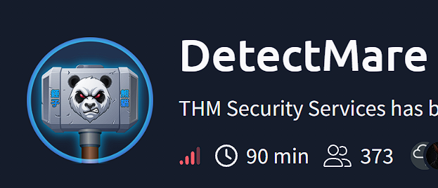
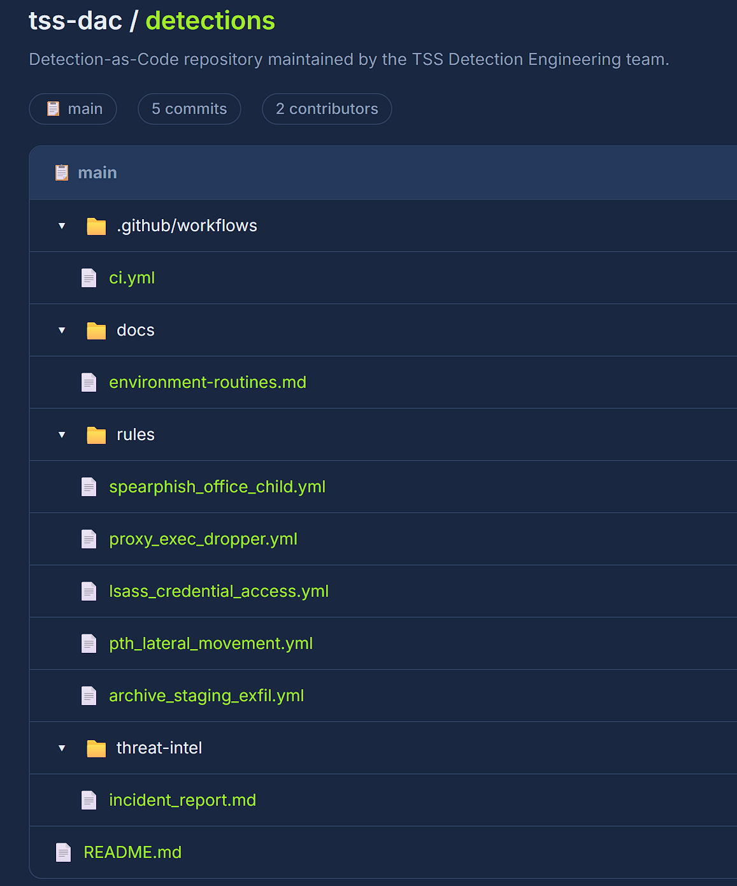
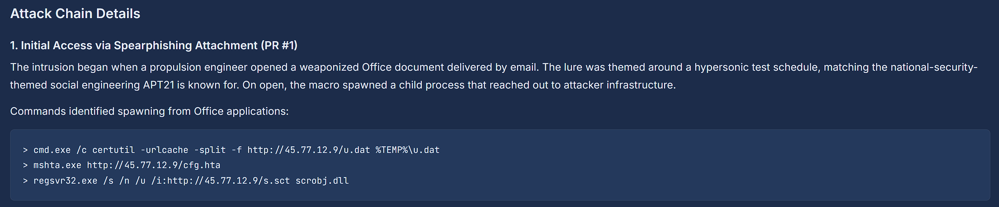
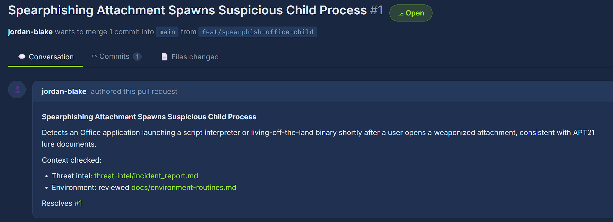
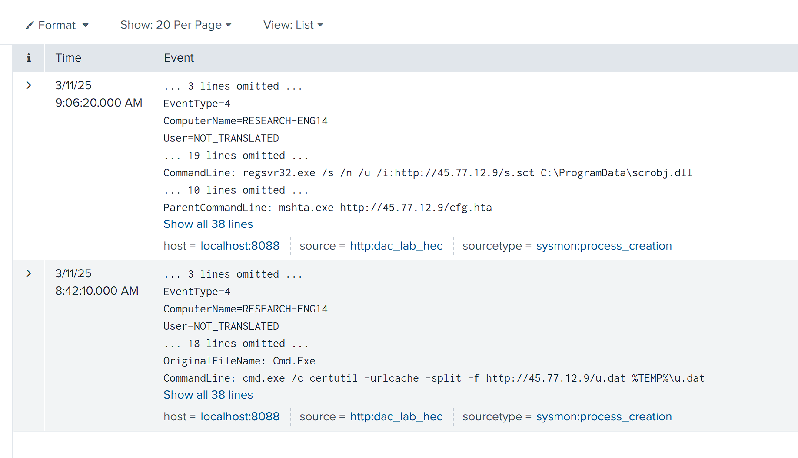
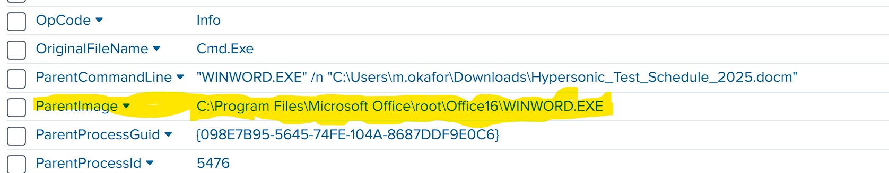
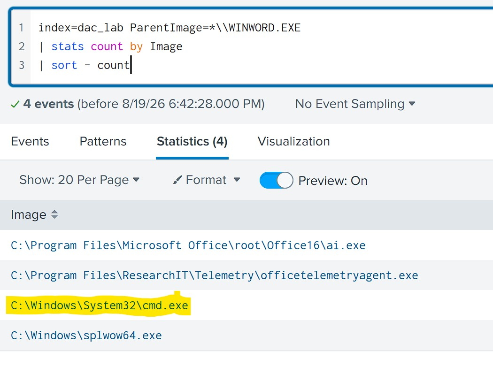
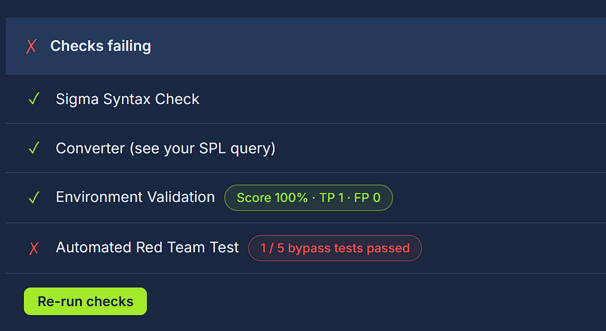
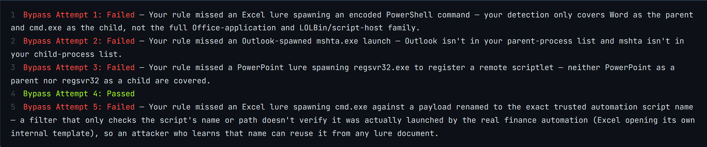
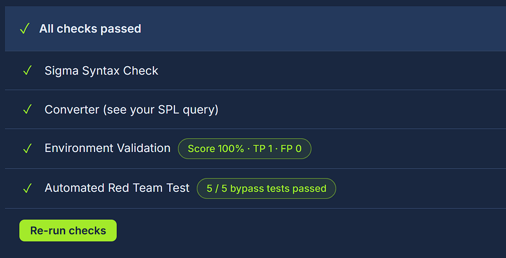

## Introduction

This writeup covers my approach to the TryHackMe room **DetectMare**. 
The room focuses on Detection-as-Code, where detection rules are managed, reviewed, and tested in a workflow similar to software development. 
The goal is to investigate a simulated intrusion in Splunk and use the findings to improve existing Sigma rules. 

**Note**: I am currently working through this room, so this writeup is a work in progress and will be updated as I complete the challenges. 

## PR #1 - My Approach



You are presented with a repository containing the material needed for the investigation. 

Before making any changes, I spent some time looking through the repository to understand what was available. The `threat-intel` directory contained the incident report, `docs` described known legitimate activity in the environment, and `rules` contained the Sigma detections that needed to be reviewed and tuned. 

I started by reading through the threat report and breaking the attack into smaller parts. Instead of trying to understand the whole intrusion at once, I focused on one part at a time and used the information in the report to decide what to look for in Splunk. 



The first piece of threat intelligence I looked at was the **Initial Access** stage of the attack chain. 
The report provides several commands associated with the activity. 



I moved on to **PR #1 - Spearphishing Attachment Spawns Suspicious Child Process** 
The pull request describes a detection for an Office application launching a script interpreter or LOLbin after a weaponized attachment is opened. 

Sigma rule: 

```yaml
title: Spearphishing Attachment Spawns Suspicious Child Process
id: 3f9a2b10-1e44-4a2b-9b0a-1a2b3c4d5e06
status: experimental
description: Detects an Office application launching a script interpreter or living-off-the-land binary, consistent with APT21 lure documents.
author: jordan-blake

logsource:
  product: windows
  category: process_creation

detection:
  selection:
    ParentImage|endswith: '\WINWORD.EXE'
    Image|endswith: '\officetelemetryagent.exe'
  condition: selection
```

The first thing that stood out was that the rule did not really match the behavior described in the threat intelligence. The report mentioned processes such as `cmd.exe`, `mshta.exe` and `regsvr32.exe`, while the rule was looking for `WINWORD.EXE` spawning `officetelemetryagent.exe`.

In the documentation it states that `officetelemetryagent.exe` was part of normal behavior, and the existing rule was likely detecting benign activity while missing the process execution described in the incident. 

Then I moved over to Splunk to look for the activity in the logs.

## PR #1 - Investigation in Splunk 

I started by searching for the affected host, `RESEARCH-ENG14`, and the malicious IP from the threat report. I wanted to see if either of them appeared in the logs and use that to continue the investigation. 



The search returned two relevant process-creation events. Both matched activity described in the threat report.



After confirming the activity, I checked whether `WINWORD.EXE` had spawned any other child processes.




## PR #1 - Sigma Rule Tuning 

After investigating the activity in Splunk, I went back to the sigma rule.
The original rule was too limitid and did not match the suspicious process activity.
Therefore I started adjusting the parent and child process conditions based on the behavior. 

### First Tuning Attempt 

I updated the rule to cover both `WINWORD.EXE` and `EXCEL.EXE` spawning `cmd.exe`, `mshta.exe` and `regsvr32.exe`.

The environment documentation also mentioned a known benign approved Excel macro launches `cmd.exe` to run `C:\Programdata\ResearchIT\Automation\monthend_report.bat`

Since this behavior would match the detection, I added a filter for the automation.

```yaml
detection:
  selection:
    ParentImage|endswith: 
      - '\WINWORD.EXE'
      - '\EXCEL.EXE'
    Image|endswith: 
        - '\cmd.exe'
        - '\mshta.exe'
        - '\regsvr32.exe'

  filter:
    ParentImage|endswith: '\EXCEL.EXE'
    Image|endswith: '\cmd.exe'
    CommandLine|contains: '\ProgramData\ResearchIT\Automation\monthend_report.bat'

  condition: selection and not filter 
```



After making the first changes, I ran the built-in checks against the rule. The Sigma syntax check passed, the rule converted succsessfully to SPL, and the environment validation scored 100%.
The automated red team test was a different story. 1 out of 5 bypass tests passed. 

The red team test used other Office applications and child processes that my rule dit not cover. There was also a weakness in the filter.



### Second Tuning attempt 

Based on the failed red team tests, I expanded the rule to cover more Office applications and child processes.
I added`OUTLOOK.EXE` and `POWERPNT.EXE` as parent processes, and `powershell.exe` and `pwsh.exe` as child processes.

For the filter, i tried to be more specific and added `ParentCommandLine`, to check that Excel had opened the approved template. 

```yaml
detection:
  selection:
    ParentImage|endswith: 
      - '\WINWORD.EXE'
      - '\EXCEL.EXE'
      - '\OUTLOOK.EXE'
      - '\POWERPNT.EXE'

    Image|endswith: 
      - '\cmd.exe'
      - '\mshta.exe'
      - '\regsvr32.exe'
      - '\powershell.exe'
      - '\pwsh.exe'

  filter:
    ParentImage|endswith: '\EXCEL.EXE'
    ParentCommandLine|contains: '\Finance\MonthEnd_Template.xlsm'
    Image|endswith: '\cmd.exe'
    CommandLine|contains: '\ProgramData\ResearchIT\Automation\monthend_report.bat'
    
  condition: selection and not filter 
```

After rerunning the checks, the rule passed all tests and i got the first flag. 



